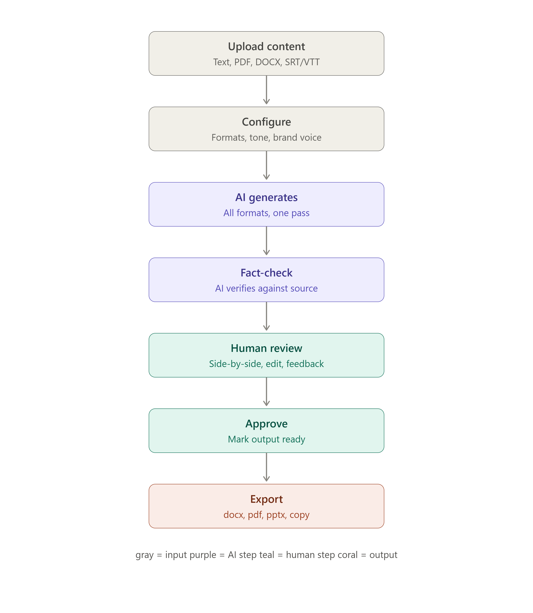

# GenAI Content Transformation Platform 🚀

> **One Input. Infinite Content.** — Transform any text, URL, image, or video into 12+ platform-ready content formats instantly using Google Gemini AI.



---

## ✨ Features

| Feature | Description |
|---|---|
| 🧠 **12+ Output Formats** | Blog, LinkedIn, Twitter Thread, Email Newsletter, Video Script, SEO, FAQ, Slides, Captions, Alt Text, Summary, Simplified |
| 🌐 **URL & YouTube Scraping** | Paste any URL or YouTube link as input — content is fetched automatically |
| 🖼️ **Image Input** | Upload images and let Gemini describe/analyse them as source content |
| 👁️ **Live Platform Mockups** | Toggle between editor and authentic pixel-perfect mockups for every format |
| 🔊 **Voiceover Studio** | Listen to any output with Play/Pause, voice selection, speed & pitch controls |
| 📦 **Export All as ZIP** | Download every generated format in one organised ZIP bundle |
| 🔗 **Share & Collaborate** | Share sessions via public link with threaded inline comments |
| 👥 **Team Workspace** | Shared brand voice profiles for consistent team outputs |
| 🕓 **Version History** | Roll back to any previous regeneration |
| 📊 **Usage Dashboard** | Track tokens, formats used, and activity in real-time |

---

## 🛠️ Tech Stack

- **Frontend:** Vanilla HTML/CSS/JS — zero build step, served statically
- **Backend:** Node.js + Express + TypeScript (`tsx` dev server)
- **AI:** Google Gemini API (`gemini-3.1-flash-lite` — free tier)
- **Storage:** JSON flat-files for shares, comments, versions

---

## 🚀 Quick Start

### Prerequisites
- Node.js ≥ 18
- A free Google Gemini API key from [aistudio.google.com](https://aistudio.google.com/apikey)

### 1. Clone the repo
```bash
git clone https://github.com/YOUR_USERNAME/YOUR_REPO_NAME.git
cd YOUR_REPO_NAME
```

### 2. Set up the backend
```bash
cd backend-genai
npm install
cp .env.example .env
# Edit .env and add your GEMINI_API_KEY
npm run dev
```

### 3. Open the app
Visit **[http://localhost:3002](http://localhost:3002)** in your browser.

> The backend serves `index.html` as a static file — no separate frontend server needed.

---

## 📁 Project Structure

```
SIH/
├── index.html              # Main frontend app (single-page)
├── shared.html             # Public read-only collaboration view
├── presentation.html       # Project presentation slides
├── backend-genai/          # Express + TypeScript backend
│   ├── src/
│   │   ├── index.ts        # Server entry point
│   │   └── routes/
│   │       ├── generate.ts # AI generation (Gemini API)
│   │       ├── collab.ts   # Share / comment / version / team APIs
│   │       └── scrape.ts   # URL & YouTube ingestion
│   ├── data/               # JSON persistence (auto-created)
│   ├── .env.example        # Environment variable template
│   └── package.json
└── sample-inputs/          # Test input files
```

---

## 🌍 Deployment

See the **Deployment** section for Railway, Render, or Vercel instructions.

---

## 📄 License

MIT — free to use, modify, and distribute.
